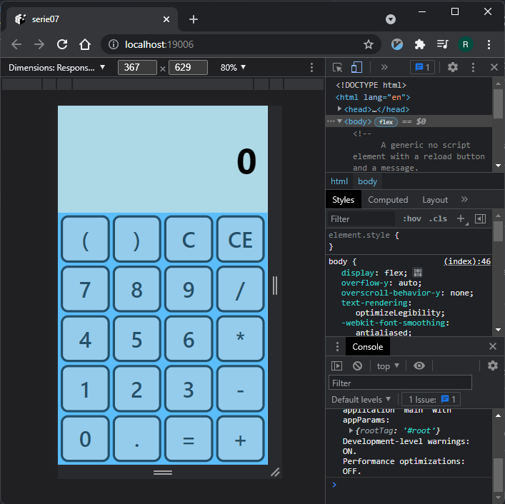
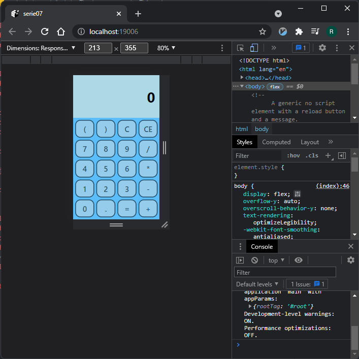
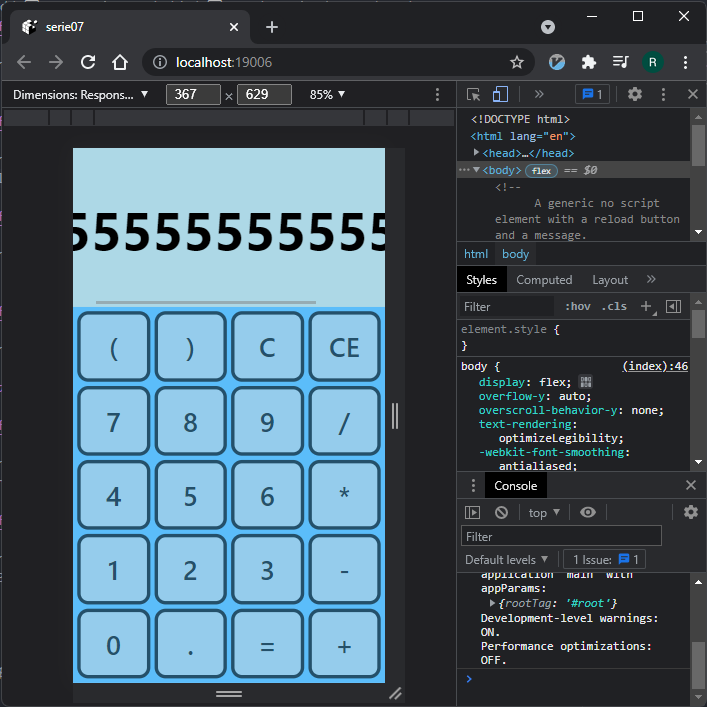

# ces26serie07 - Relatório
### Aluno: Ricardo Macedo Pacheco

___

___

Figura 1: Página da calculadora logo após ser aberta.

___

Figuras 2 e 3: A calculadora continua funcionando (agora com parênteses!).
___

# Features Adicionais:

Como visto, tá bonitinha.
___

Figura 4: O design é totalmente responsivo. Inclusive, tamanhos de fonte e bordas escalam com o tamanho do display!
___

Figura 5: Quando o texto do display da calculadora dá overflow, aparece uma scrollbar horizontal.
___

Para executar:

    $ npm start

